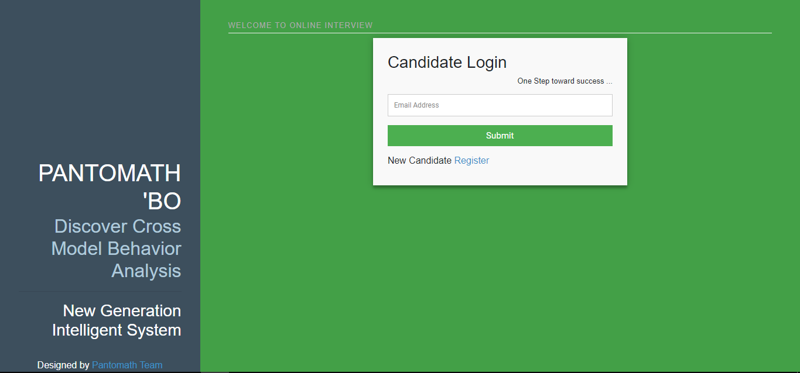
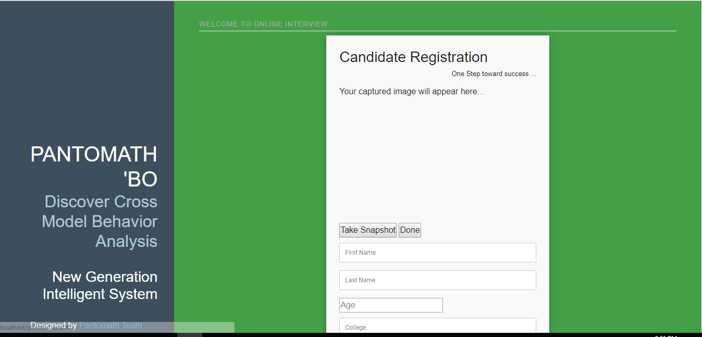
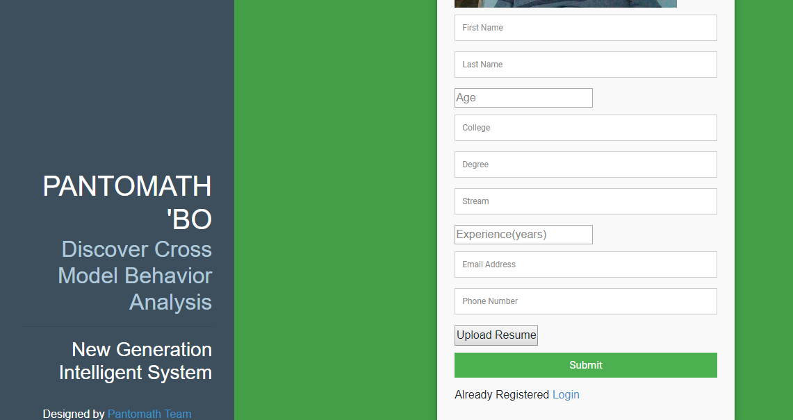
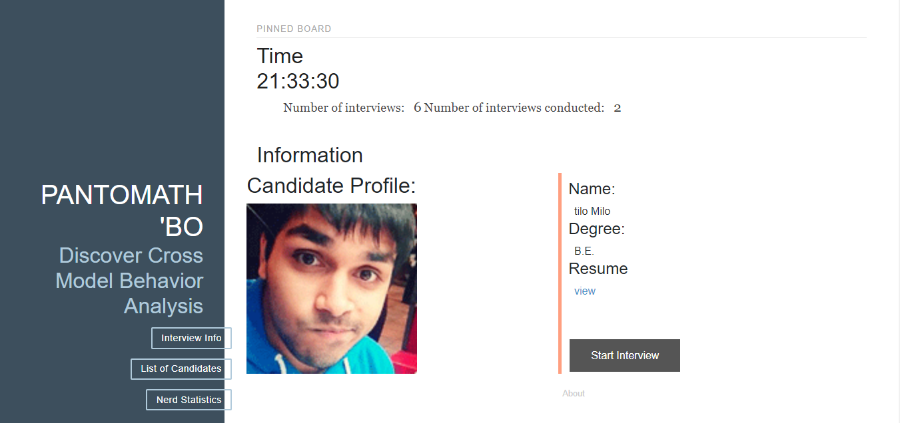
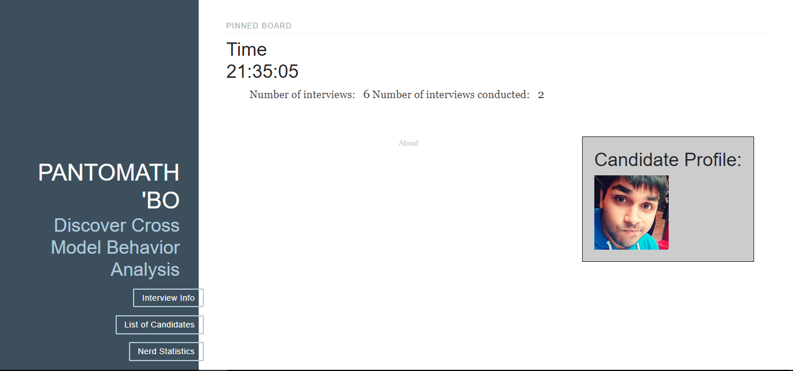
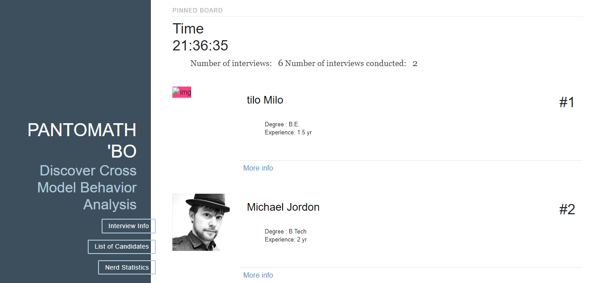
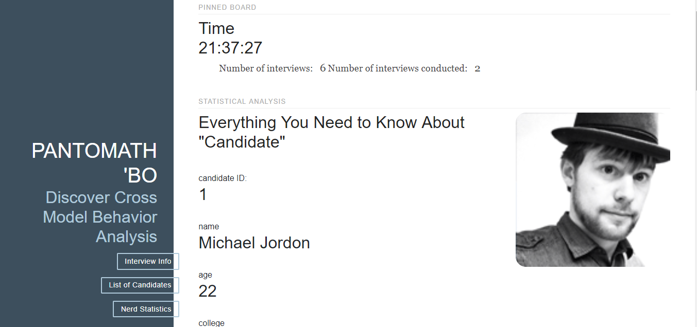
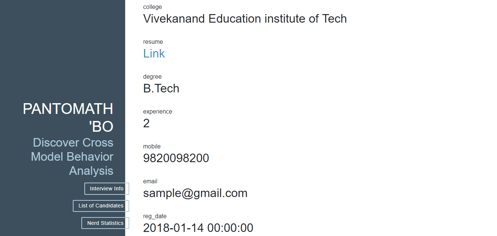
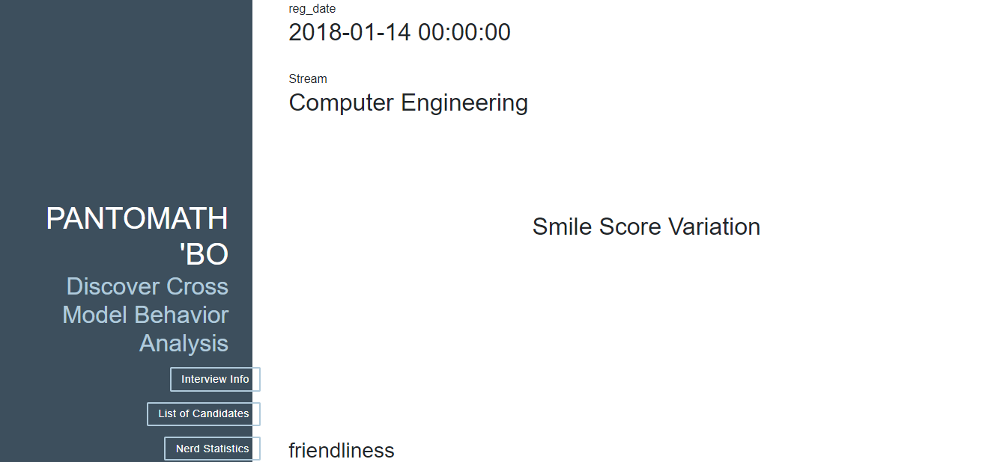
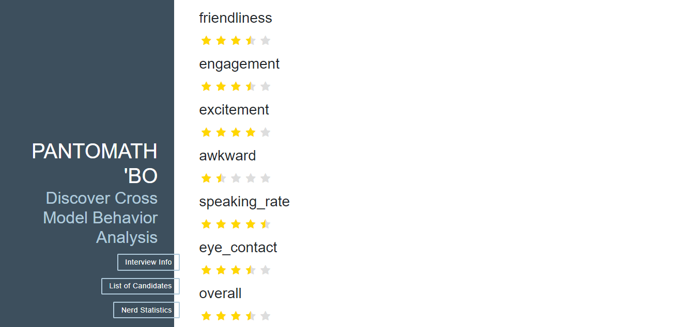

# use xampp

import that database file in database folder

if user is not created please create the user privilage and update same in database script file in
serverScript/class folder

	copy all the file in xampp/htdoc/any_named_folder and 

# Steps to run code

	type: localhost/front-end/  in address bar

# update:
	- Interview start Progress bar added
	- streaming issue resolved
	- UI modified in interview page
	- connectivity issue resolved
	- resume broken link resolve
	- image format resolved
	- concurrent video and audio processing added
	- login redirect resolved
	- interview page start and stop button error resolved
	- interview realtime graph resolved
	-One page Added
		-login and register UI
	-two pages are added
		- candidate list view of those who have given the interview with ranking
		- detail of the candidate is avaiable with the feature parameter

# Instruction to run in realtime
	Enter the email id of the candidate and press proceed to interview button to initiate the Interview process
	open the detail page of any candidate and go to lower section. realtime analytics are viewable

# future update:
	Multiple Interview Environeent capability maybe added
	Multiple Interview support can be added

# Instruction for How to Contribute ?
	1.	Fork the project to your git remote project repo
	2.	Clone project to your local repo
	3.	Create new branch so that you can track both edited and original code
	4	Edit project and commit in your local repo
	5.	sync the changes with your remote repo
	6.	Go to Github website there you will find compare and pull-request near new branch added message
	7.	Bingo! you did it, yeah....	
 
 # Images
	1. Login Area

	2. Registration Page

	2. Interview Start Page and Candidate Summary

	2. Interview page and candidates realtime analytics

	2. Candidate Ranking page

	2. Candidate details

# Contributors
	Ankit Shaw [https://github.com/ankitshaw]
	Pratik Watwani [https://github.com/pratikwatwani]
	Swastika Thakur [https://github.com/swastika-thakur]
